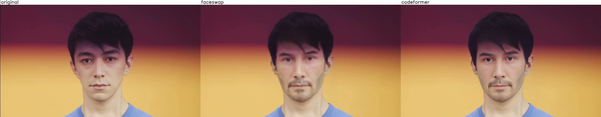

# Join the discord server (this is not official roop server!) https://discord.gg/hzrJBGPpgN
Take a video and replace the face in it with a face of your choice. You only need one image of the desired face. No dataset, no training.

Also allow row render (original, faceswap, enchance face via codeformer or gfpgan):



[colab link](https://colab.research.google.com/github/RichardErkhov/Richard-roop/blob/main/richard-roop-main.ipynb)

# easy installation guide for windows users
```
1) install visual studio 2022 with desktop development C++ and python development (not sure about python development)
2) install python 3.10.x (any 3.10)
3) download the last version of roop
4) pip install virtualenv
5) virtualenv venv
6) start venv\scripts\activate.bat
7) pip install -r requirements.txt
that's for cpu (sometimes works for gpu for some reason)
if you want nvidia gpu to work:
don't go for cpu
1) install visual studio 2022 with desktop development C++ and python development (not sure about python development)
2) install cuda 11.7 (https://developer.nvidia.com/cuda-11-7-0-download-archive)
3) download cudnn 8.9.1 for cuda 11.x https://developer.nvidia.com/rdp/cudnn-archive
4) unpack cudnn over C:\Program Files\NVIDIA GPU Computing Toolkit\CUDA\v11.7 with replacement
5) install python 3.10.x (any 3.10)
6) download the last version of roop
7) pip install virtualenv
8) virtualenv venv
9) start venv\scripts\activate.bat
10) pip install torch torchvision torchaudio --force-reinstall --index-url https://download.pytorch.org/whl/cu117
11) pip install -r requirements.txt
and yes, don't forget to download ffmpeg https://ffmpeg.org/download.html
and inswrapper_128.onnx https://drive.google.com/file/d/1eu60OrRtn4WhKrzM4mQv4F3rIuyUXqfl/view?usp=drive_link
```

# usage example 
```
#usage is simple:
python run.py --gpu --gpu-threads %number_of_threads%
```
for number of threads I recommend to play, for nice approximation of first step is:
amount of threads = (GPU VRAM - 1)/800


# Face enchancement

You can also apply face enchancement by codeformer or gfpgan (slow!!)

## For gfpgan (slightly faster then codeformer)

To do:
- In options/core.json change "default_chain": "facedetect,faceswap,gfpgan"

Or if you want just enhance your video:
- In options/core.json change "default_chain": "facedetect,gfpgan"

## For codeformer

To do:
- Download plugin here: https://github.com/janvarev/chain-img-plugin-codeformer
- Copy it to plugins folder
- Install requirements.txt
- In options/core.json change "default_chain": "facedetect,faceswap,codeformer"

Or if you want just enhance your video:
- In options/core.json change "default_chain": "codeformer"

It's recommended to set settings in options/codeformer.json like:
```json
{
    "background_enhance": false,
    "codeformer_fidelity": 0.5,
    "face_upsample": true,
    "skip_if_no_face": true,
    "upscale": 1
}
```

### For gfpganonnx

Effective implementation of GFPGAN on ONNX (I gain 2.5x speedup)

To use: 
- convert GFPGAN model to ONNX format https://github.com/xuanandsix/GFPGAN-onnxruntime-demo/tree/main
- your resulted model must be placed as `./models/GFPGANv1.3.onnx`
- In options/core.json change "default_chain": "facedetect,faceswap,gfpganonnx"
- Note: If you wanna just ehchance face on current video, use "default_chain": "facedetect,gfpganonnx"

# Faceswap selective

Allow you to selective swap faces on img/video, the same as in "refacer" project

To use:
- run program at least once
- In options/core.json change "default_chain": "facedetect,faceswap_selective" (you can use enchancer if you want)
- In options/plugin_faceswap_selective.json change "selective" to "char1.jpg->new1.jpg||char2.jpg->new2.jpg", where
  - char1.jpg is path to file with someone face from original video
  - new1.jpg is path to file with face that replace char1
  - -> is separator
  - || is separator for groups (you can set char2,new2 etc.)
  - NOTE: face in roop interface will not being used in this case
- Each face on scene will be compared to reference in "selective" option. If distance is lower than "max_distance" - face will be replaced (try to adjust "max_distance" if you have problems). 

# Special thanks

https://github.com/janvarev/chain-img-processor licensed under MIT

TL;DR. This tool was created just to make fun to remake memes, put yourself in the movies and other fun things. Some people on the other hand are doing some nasty things using this software, which is not intended way to use this software. Please be a good person, and don’t do harm to other people. Do not hold my liable for anything.
This tool is provided for experimental and creative purposes only. It allows users to generate and manipulate multimedia content using deep learning technology. Users are cautioned that the tool's output, particularly deepfake content, can have ethical and legal implications.
TL;DR ended ====


Educational and Ethical Use: Users are encouraged to use this tool in a responsible and ethical manner. It should primarily serve educational and artistic purposes, avoiding any malicious or misleading activities that could harm individuals or deceive the public.

Informed Consent: If the tool is used to create content involving real individuals, ensure that you have obtained explicit and informed consent from those individuals to use their likeness. Using someone's image without permission can infringe upon their privacy and rights.

Transparency: If you decide to share or publish content created with this tool, it is important to clearly indicate that the content is generated using deep learning technology. Transparency helps prevent misunderstandings and misinformation.

Legal Considerations: Users are responsible for complying with all applicable laws and regulations related to content creation and sharing. Unauthorized use of copyrighted materials, defamation, and invasion of privacy could lead to legal consequences.

Social Responsibility: Please consider the potential social impact of the content you create. Misuse of this tool could contribute to the spread of misinformation, deepening distrust, and undermining the credibility of authentic media.

No Warranty: This tool is provided "as is," without any warranties or guarantees of any kind, either expressed or implied. The developers of this tool are not liable for any direct, indirect, incidental, special, or consequential damages arising from the use of the tool.

Feedback and Improvement: We encourage users to provide feedback on their experiences with the tool. Your insights can contribute to refining the technology and addressing potential concerns.

By using this tool, you acknowledge that you have read and understood this disclaimer. You agree to use the tool responsibly and in accordance with all applicable laws and ethical standards. The developers of this tool retain the right to modify, suspend, or terminate access to the tool at their discretion.


